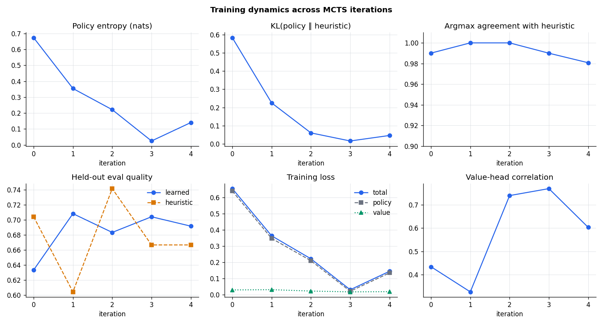

# MVP Success Criteria Validation (Issue #31)

*Final Phase-5 deliverable. Every number below is extracted mechanically from
committed run artifacts by `scripts/validate_mvp.py`, which writes the
machine-readable verdict to `data/mvp_validation.json` (the determinations in
this document are tested against that output). No live model calls are
involved; re-running after new data lands is free.*

```
uv run python scripts/validate_mvp.py --out data/mvp_validation.json
```

## Executive summary

| # | Criterion | Determination |
|---|---|---|
| 1 | Learned policy beats **random** by ≥ 15% on task quality | **FAIL** (+4.7%, p = 0.29) |
| 2 | Learned policy beats **heuristic** by ≥ 8% on task quality | **FAIL** (+4.0%, p = 0.36) |
| 3 | At least one emergent timing pattern not in the heuristic | **PASS** (learned inhibition gate) |
| 4 | Training converged within 500 episodes | **PASS** (250 episodes) |
| 5 | Fewer unintended interrupts than the heuristic | **UNRESOLVABLE** (both exactly 0) |
| 6 | Queue-based delivery beats synchronous injection on derailments | **UNEVALUATED** (no synchronous-arm data) |

The honest overall picture:

- **The architecture works end-to-end.** The full pipeline — subconscious tool
  layer, queue-based context delivery, MCTS self-improvement training, and a
  5-condition × 100-task comparative evaluation — ran live with zero transport
  failures (500 comparative episodes plus 250 training episodes, all
  committed). Training converged well inside its episode budget, and the
  trained policy was deployed and measured as a first-class condition.
- **An emergent behavior was genuinely learned.** The policy taught itself a
  "fire one tool early, then suppress" inhibition gate that is not written
  anywhere in the heuristic baseline (criterion 3, evidence in
  [emergent_behavior_2026-07.md](emergent_behavior_2026-07.md)).
- **But the MVP's headline quality-improvement thresholds are not met.** At
  the measured effect sizes the learned policy adds **+2 to +4 points of task
  quality on a 100-point scale** over the baselines (+2.9 vs random, +2.5 vs
  heuristic, +4.1 vs the no-subconscious control) at a **~64% token premium**
  over running with no subconscious layer at all — and none of these
  differences is statistically significant (best p = 0.137).
- **The direction is consistent, the power is not.** The hypothesized quality
  ordering (subconscious conditions above controls; learned at the top)
  appeared directionally in **two independent runs** — the #46 baseline rerun
  and the #30 comparative evaluation — without reaching significance in
  either. The #46 power analysis estimates roughly 230 episodes/condition are
  needed to resolve effects of this size; both runs used ≤ 100. An
  **adequately powered confirmation run is tracked in #89**.

In short: the system is built, trained, and instrumented as specified, and
learning demonstrably happened — but on today's evidence the learned
subconscious does **not** deliver the quality gains the MVP promised, and the
two headline criteria fail.

## How to read the numbers

- **task_quality** is an LLM-judge rubric score in [0, 1] (higher is better),
  judged by a fixed model (`gemma4:31b-cloud`) that never sees which condition
  produced a transcript. "+4 points" means +0.04 on this scale.
- **Conditions** (100 tasks each, identical task list, seed 42):
  - `no_subconscious` — the plain assistant, no background tool layer (control).
  - `random` — subconscious layer with a random invocation policy (control).
  - `heuristic` — hand-written invocation rules (the baseline to beat).
  - `learned_no_search` — **the trained policy as deployed** (network only,
    no inference-time search). This is "the learned policy" throughout.
  - `learned_with_search` — the same network with inference-time MCTS
    (reported as a sensitivity check; it scored slightly *lower*: 0.6392).
- CIs are 95%; p-values are two-sided Welch t-tests.
- Sources: `data/comparative/report.{json,md}` (#30),
  `data/mcts_training/metrics_history.json` (#29),
  `docs/figures/emergent/emergent_stats.json` (#32).

## Criterion 1 — Learned > random by ≥ 15% on task quality

**Determination: FAIL.**

| Condition | task_quality mean [95% CI] | n |
|---|---|---|
| learned_no_search | 0.6475 [0.6077, 0.6873] | 100 |
| random | 0.6183 [0.5815, 0.6551] | 100 |

- Absolute difference: **+0.0292** (95% CI of the difference
  **[−0.0247, +0.0831]** — it spans zero).
- Relative improvement: **+4.7%**, versus the **15%** the criterion requires.
- Welch t-test: t = 1.068, **p = 0.287** — not significant.

The measured effect is less than a third of the required threshold, and the
data cannot even rule out zero (or a small negative) effect. Fails on the
point estimate; fails on significance.

## Criterion 2 — Learned > heuristic by ≥ 8% on task quality

**Determination: FAIL.**

| Condition | task_quality mean [95% CI] | n |
|---|---|---|
| learned_no_search | 0.6475 [0.6077, 0.6873] | 100 |
| heuristic | 0.6225 [0.5854, 0.6596] | 100 |

- Absolute difference: **+0.0250** (95% CI **[−0.0291, +0.0791]**).
- Relative improvement: **+4.0%**, versus the required **8%**.
- Welch t-test: t = 0.911, **p = 0.363** — not significant.

Half the required effect, not significant. Consistent with the #32 finding
that training distilled the policy *toward* the heuristic (final action
agreement 98.1%): a policy that acts almost identically to the baseline
cannot outscore it by 8%.

*Context for both criteria:* the strongest contrast in the whole grid —
learned vs the `no_subconscious` control — is +0.0408 (+6.7% relative,
p = 0.137), bought at a token cost of 5,465 vs 3,330 per episode (**+64%**).
The full hypothesized ordering (learned > heuristic > random >
no_subconscious) did appear, and the heuristic-above-controls direction
replicated the independent #46 baseline rerun
([baseline_rerun_2026-07.md](baseline_rerun_2026-07.md)), but no task-quality
pair in either run is significant. Direction: consistent. Magnitude: far
below the MVP bar. Power: insufficient (~230 episodes/condition needed per
the #46 calculation; confirmation tracked in **#89**).

## Criterion 3 — At least one emergent timing pattern not in the heuristic

**Determination: PASS** — the learned **secondary-tool inhibition gate**
("fire one tool early, then suppress"), established by the #32 analysis
([emergent_behavior_2026-07.md](emergent_behavior_2026-07.md)).

The pattern, in plain terms: early in training the policy often fired a
redundant second background tool in the same episode; by the end of training
it had learned to fire exactly one tool on the first turn and then hold back
— a rule that appears nowhere in the hand-written heuristic (which only has
fixed interval/stop rules, no "already invoked this episode, so stop").

Evidence (from `docs/figures/emergent/emergent_stats.json`, 250 training
episodes and 5 checkpoints):

1. Multi-tool episode rate across training iterations:
   **28% → 24% → 4% → 2% → 2%**, while held-out eval quality stayed flat —
   the suppression was learned without a quality trade-off.
2. Probing every checkpoint on the same 104 reconstructed decision points,
   the invocation-probability gap between turn 1 (no tool fired yet) and
   turn 2+ (tool already fired) widens **0.70 → 0.88 → 0.92 → 1.00 → 0.96**
   as policy entropy collapses.
3. At the final checkpoint the gate is near-binary on tool history:
   P(invoke) = **0.988** at turn 1 vs **0.024** at turn 2+ (gap 0.96, well
   above the 0.5 pass rule in `scripts/validate_mvp.py`).

Figures: `docs/figures/emergent/emergent_inhibition.png`,
`timing_by_turn.png`. The #32 report also states the negative results plainly
(no queue-aware inhibition, compound tool sequences are a transient of early
exploration), so this pass is scoped to the inhibition gate only.

## Criterion 4 — Training converged within 500 episodes

**Determination: PASS.** The #29 MCTS training run used **250 episodes**
(5 iterations × 50), half the budget, and converged by every tracked measure:

| Iteration | Episodes (cum.) | Policy entropy (nats) | Train loss | KL from heuristic |
|---|---|---|---|---|
| 0 | 50 | 0.674 | 0.654 | 0.583 |
| 1 | 100 | 0.354 | 0.363 | 0.225 |
| 2 | 150 | 0.221 | 0.222 | 0.060 |
| 3 | 200 | 0.025 | 0.031 | 0.016 |
| 4 | 250 | 0.140 | 0.145 | 0.046 |

- Policy entropy collapses **0.67 → 0.14** nats (minimum 0.025 at iteration
  3; the iteration-4 uptick comes from fresh MCTS targets on newly collected
  data, expected with a moving target).
- Training loss falls **0.65 → 0.14** (minimum 0.031) — a 78% reduction,
  against the ≤ 25%-of-initial pass rule in `scripts/validate_mvp.py`.
- KL from the heuristic reaches 0.046 with 98% action agreement — the policy
  stopped moving.

Convergence curve (entropy, loss, KL, and agreement per iteration):



(Regenerate with `uv run --extra torch python
scripts/analyze_emergent_behavior.py`.)

Caveat, stated so the pass is not over-read: the policy converged *to the
heuristic*, not past it — see criterion 2.

## Criterion 5 — Fewer unintended interrupts than the heuristic

**Determination: UNRESOLVABLE** (not decidable from this data).

Measured interrupt rate over 100 episodes per condition: learned
**0.00 [0, 0]**, heuristic **0.00 [0, 0]**. Difference: 0.00 [0, 0].

The criterion's letter asks for *fewer* interrupts than the heuristic.
Zero-equals-zero is not "fewer", so a literal reading fails; but we decline
to score it either way, for a structural reason: the comparative evaluation
ran in **BREAKPOINT injection mode**, which drains the context queue at every
turn boundary before any interrupt threshold can be crossed. Mid-turn
interrupts were therefore *impossible by construction* for every condition —
the metric carried no information in this configuration (the same
degeneracy is documented in the #32 analysis and holds across all 250
training episodes). Declaring a "pass by vacuity" would credit the learned
policy for something the harness precluded; declaring a failure would
penalize it for the same artifact. What the data does support: the learned
policy is trivially **no worse** (0 ≤ 0). A meaningful test needs episodes
run in INTERRUPT mode with reachable thresholds (`AB_INTERRUPT_CONFIG` in
`src/bicameral_agent/ab_test.py` exists for exactly this purpose) and is
subsumed by the criterion-6 run below.

## Criterion 6 — Queue-based delivery produces fewer derailments than synchronous injection

**Determination: UNEVALUATED** — the required A/B data was never collected.

This criterion needs the #22 A/B test comparing injection strategies
(synchronous vs queue-based) on derailment counts. The framework is
implemented and unit-tested (`src/bicameral_agent/ab_test.py`: three
conditions — `synchronous`, `breakpoint`, `interrupt` — with derailment
counting from the simulated user's own follow-up labels), but **no live run
of it was ever committed**. A scan of every committed episode corpus finds
**1,095 episodes, all in BREAKPOINT mode and zero in SYNCHRONOUS mode**
(`data/baseline*`, `data/comparative`, `data/mcts_training`), so there is no
synchronous arm to compare against, and we will not manufacture a verdict
without one.

The exact command that would produce the missing data (live LLM calls;
budget ~150 episodes for 50 tasks × 3 conditions):

```
GEMINI_API_KEY=... uv run python - <<'PY'
from pathlib import Path

from bicameral_agent.ab_test import ABTestRunner, default_conditions
from bicameral_agent.eval_datasets import build_dataset
from bicameral_agent.gemini import GeminiClient
from bicameral_agent.heuristic_controller import HeuristicController

Path("data/ab_test").mkdir(parents=True, exist_ok=True)
tasks = build_dataset("builtin").load().eval_tasks()[:50]
result = ABTestRunner(GeminiClient()).run(tasks, default_conditions(HeuristicController))
result.to_json("data/ab_test/report.json")
result.to_csv("data/ab_test/episodes.csv")
PY
```

Once `data/ab_test/report.json` is committed, `scripts/validate_mvp.py`
detects it automatically and resolves this criterion to PASS/FAIL on the
derailment means — no code change needed.

## Where this leaves the MVP

Two criteria pass (emergent behavior, convergence), two fail (both headline
quality thresholds), one is unresolvable on structurally degenerate data
(interrupts), and one was never run (derailment A/B). The engineering goals
of the MVP are met; the *performance* goals are not, at the effect sizes two
independent runs agree on. The decisive next step is not more architecture —
it is statistical power: the adequately powered comparison (and the deferred
Gemini-answerer arm) tracked in **#89**, plus the criterion-6 A/B run above.
